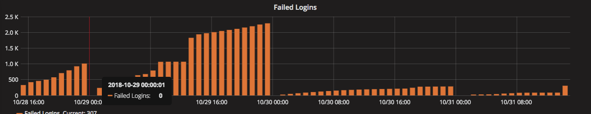
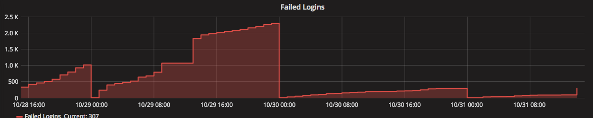
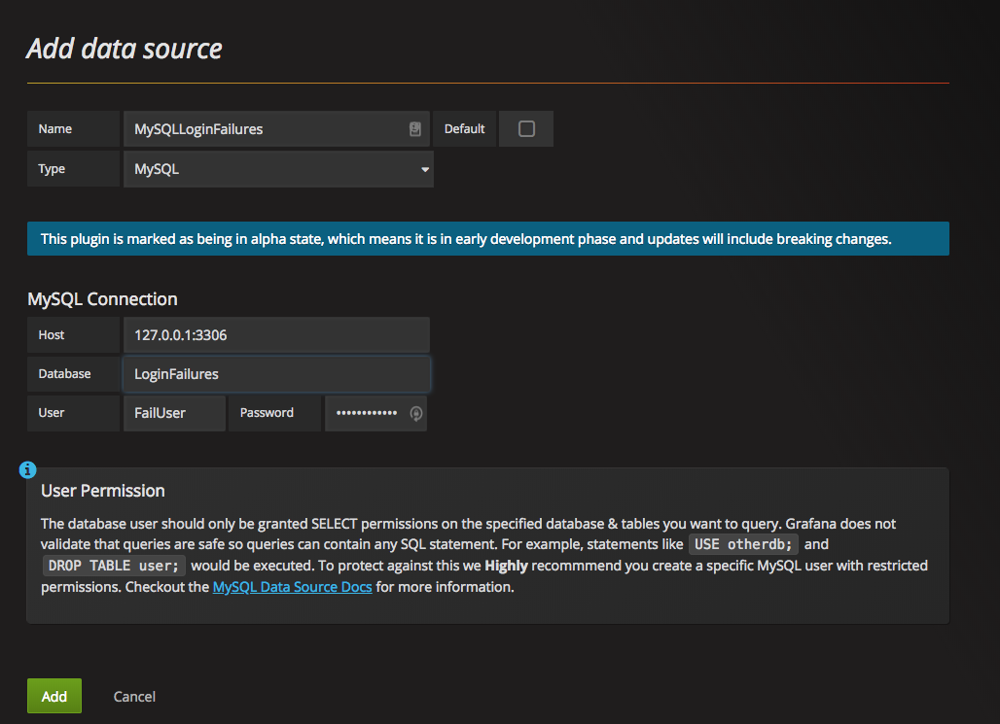

# Grafana System Login Failures

This is how I graph, and monitor the number of login failures on a Linux server using Grafana with a MySQL data source.

Ultimately, that graph will look something like this.

or this:

## Getting Started

You'll need to have a basic understanding of Linux System Administration, a MySQL Database, and Grafana to make any sense of what I'm doing here.

### Installing

There are just a few steps needed to make this all work.
1. Creating the MySQL database, and creating a user tha has read and write privileges to that database.
2. Importing the table schema for the database, which will contain all of our recorded failed logins.
3. Setting up a cronjob to regularly update that DB (I run my cronjob hourly.)
4. Defining a datasource in Grafana that uses this MySQL DB
5. Creatng a new Graph in Grafana, which will display the number of failed login attempts.

### Detailed Steps
**MYSQL:**
1. Create the database: `mysql> CREATE DATABASE LoginFailures;`
2. Switch to the database: `mysql>  USE LoginFailures;`
3. Create the database table: `mysql> CREATE TABLE Fails ( id int auto_increment, FailDate datetime, FailCount int, primary key(id) );`
4. Create the DB user that will both populate and read data from the DB: `mysql> GRANT ALL PRIVILEGES ON LoginFailures.* TO 'FailUser'@'localhost' IDENTIFIED BY 'create_a_complex_password_here'`

**Grafana:**
1. Create a new DataSource using that MySQL DB.
2. Login to Grafana, select Data Sources, click "`+ Add data source`"
3. Complete the details for adding a data source, see the image below for an example.

4. After the data source has been created, add a graph, call it whatever you'd like.
5. Edit the graph, select the Data source you just created in step 4.
6. After selecting the Data source, your query should look something like:
`SELECT
  UNIX_TIMESTAMP(FailDate) as time_sec,
    FailCount as value,
      'Failed Logins' as metric
      FROM Fails
      WHERE $__timeFilter(FailDate)
      ORDER BY FailDate ASC`
7. Click on the `Display` tab, and check 'Lines` (or bars, if you'd prefer vertical bars, see examples above.)

**Shell Script:**
1. Copy the `loginfailures.sh` shell script from this repo to some directory on your server.
2. Update the contents of the shell script to connect to the correct db, table, and username/pass.
3. Change the permissions on the script to allow execution (ex: chmod 755 loginfailures.sh)
4. Update the root user's cron to regularly execute the loginfailures.sh script, or execute the script as a user that has sudo access.

## Built With

* [Grafana](http://www.grafana.com) - The open source time series framework used.
* [MySQL](https://dev.mysql.com) - The open source database used.

## Contributing

Please read [CONTRIBUTING.md](https://github.com/deetoo/GrafanaSystemLoginFailures/CONTRIBUTING.md) for details on our code of conduct, and the process for submitting pull requests to us.

## Authors

* **Doug Dobies** - *Initial work* - [deetoo](https://github.com/deetoo)

See also the list of [contributors](https://github.com/deetoo/GrafanaSystemLoginFailures/contributors) who participated in this project.

## License

This project is licensed under the MIT License - see the [LICENSE.md](LICENSE.md) file for details

## Acknowledgments

* [PurpleBooth](https://github.com/PurpleBooth) for the excellent README template!

